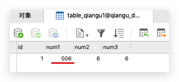

# 04-MySQL字段的数据类型

## 前言

MySQL 中的字段，主要有四种数据类型：

* 整型（整数）
* 浮点型（小数）
* 字符串类型
* 时间日期类型

下面来详细讲一讲。

## 整数类型

### 整数类型的分类

MySQL中，整型有五种：

* 迷你整型：tinyint，使用**1个字节**存储整数，最多存储256个整数（-128~127）。
* 短整型：smallint，使用**2个字节**存储整数。
* 中整型：mediumint，使用**3个字节**存储整数。
* 标准整型：int，使用**4个字节**存储整数。
* 大整型：bigint，使用**8个字节**存储。

**强调**：

（1）如果你不知道用哪一种，或者懒得计算，那就用标准整型 `int`吧，这个用的最多。

（2）整型在 MySQL 中默认是有符号的，即有正负；无符号需要使用 `unsigned` 修饰整型，代表正整数。

**举例**：

在指定的表中新增 age 字段，要求 age 是正整数：

```sql
alter table table_qiangu1 add age int unsigned;
```

### 设计思路

如果需要新建整型的字段，设计思路如下：

（1）确定需要存储的数据是整数。

（2）预估整数的范围，选择合适的整数类型。

（3）确定这个整数是否需要包含负数。

### 整数类型的取值范围

todo。参考链接：[https://blog.csdn.net/slyjit/article/details/54290486](https://blog.csdn.net/slyjit/article/details/54290486)

### 整数类型的显示宽度、零填充

> 我们在很多设计表中，可能会看到比如 `int(11)`这种数据类型，这里面的 `11`代表的就是`显示宽度`。

所谓的**显示宽度**，其实就是显示的时候，看到的最少数字个数。

比如 int\(2\) ，表示不管你的数值是多少，最少可以看到两个数字。假如你存的数值是9，没有满两位，就会在前面补零，显示为`09`；假如你的数值是120，超过了显示宽度，则直接显示原始值，不会做**零填充**。

**显示宽度的注意事项**：

* 显示宽度只适用于 MySQL 的整数类型。
* 显示宽度只是指明 MySQL 整数类型最少显示的数字个数（可以通过desc查看表字段显示）。
* **显示宽度只是在显示的时候改变数值的样式，不会对原本的值进行更改**。
* 显示宽度和数值类型的取值范围无关。例如int\(10\) 他的取值范围任然是\(-2 147 483 648，2 147 483 647\)。

**零填充的注意事项**：

* 要想让显示宽度自动进行**零填充**，必须要配合 `ZEROFILL`这个关键字一起使用。
* **零填充只能针对正整数**，也就是说，`ZEROFILL` 要求整型为无符号型。

**举例**：

1、新建一张表，然后在这张表中新增 num1 字段，要求 num1 显示3位，不够3位的自动进行零填充：

```sql
# 新建一张表
CREATE TABLE table_qiangu1 (
  id int NOT NULL AUTO_INCREMENT PRIMARY KEY
);

# 显示宽度有效（正确写法）
alter table table_qiangu1 add num1 int(3) zerofill;

# 对比：显示宽度无效
alter table table_qiangu1 add num2 int(3);

# 对比：普通写法
alter table table_qiangu1 add num3 int;
```

上述命令中，如果把 `zerofill` 这个关键字去掉，是达不到显示宽度的效果的。执行完上述命令后，我们执行 `desc table_qiangu1` 命令，对比一下 num1、num2、num3 的字段结构就知道了：


上方截图可以看到，只有 num1 才有显示宽度，它可以进行零填充，num2、num3不行。我们往表中插入整数 `6`，然后看看显示结果，就一目了然：



参考链接：[MySql数据库 数值类型的显示宽度](https://juejin.im/post/5b24a2c251882574d73c6f82)

